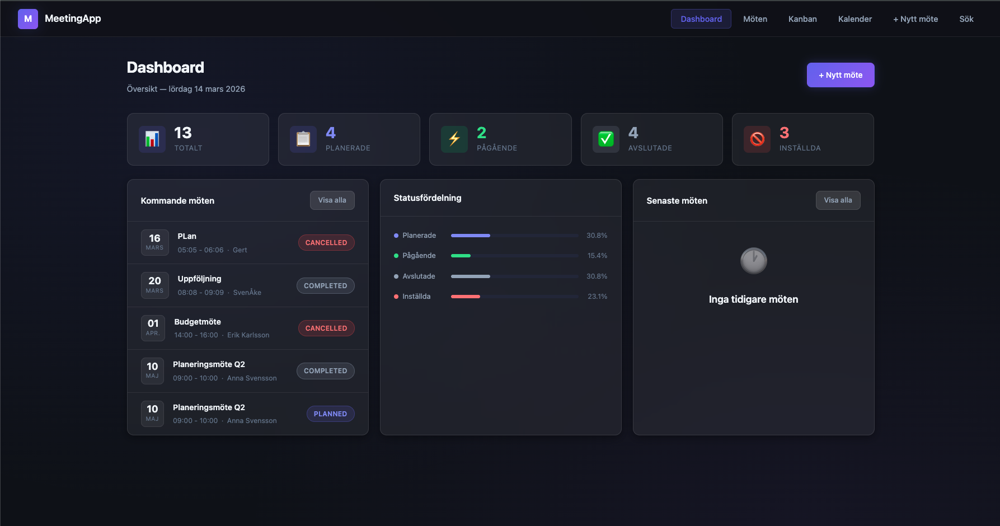
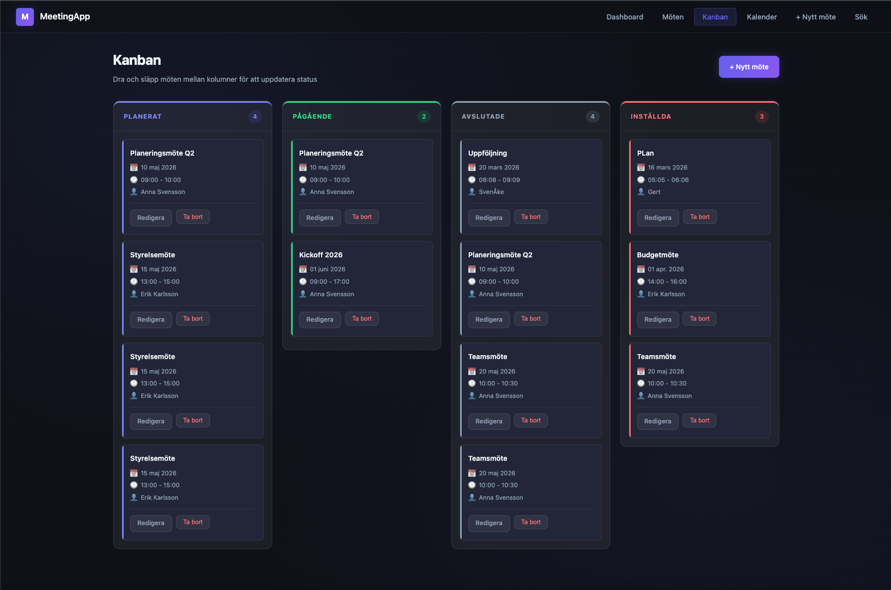

# MeetingApp

En professionell möteshanteringsapplikation byggd med Spring Boot och Thymeleaf.

## Skärmdumpar




## Tekniker

- **Backend:** Java 21, Spring Boot, Spring MVC, Spring Data JPA
- **Frontend:** Thymeleaf, CSS (glassmorphism, mörkt tema)
- **Databas:** PostgreSQL (Docker) / H2 (in-memory)
- **Tester:** JUnit 5, Mockito, MockMvc

## Funktioner

- CRUD för möten med Bean Validation
- Kanban-vy med drag & drop
- Dashboard med statistik och statusfördelning
- Kalendervy per månad
- Filtrering och sökning
- Paginering
- Felhantering med egna undantag

## Kom igång

### Krav
- Java 21
- Maven
- Docker Desktop

### Starta
```bash
# Starta databasen
docker compose up -d

# Starta applikationen
./mvnw spring-boot:run
```

Öppna `http://localhost:8080` i webbläsaren.

### Tester
```bash
./mvnw test
```

## Struktur
```
src/main/java/org/example/meetingapp/
├── controller/   # HTTP-lager
├── service/      # Affärslogik
├── repository/   # Dataåtkomst
├── entity/       # JPA-entiteter
├── dto/          # Data Transfer Objects
├── mapper/       # Entity ↔ DTO
├── exception/    # Felhantering
└── validation/   # Custom validators
```